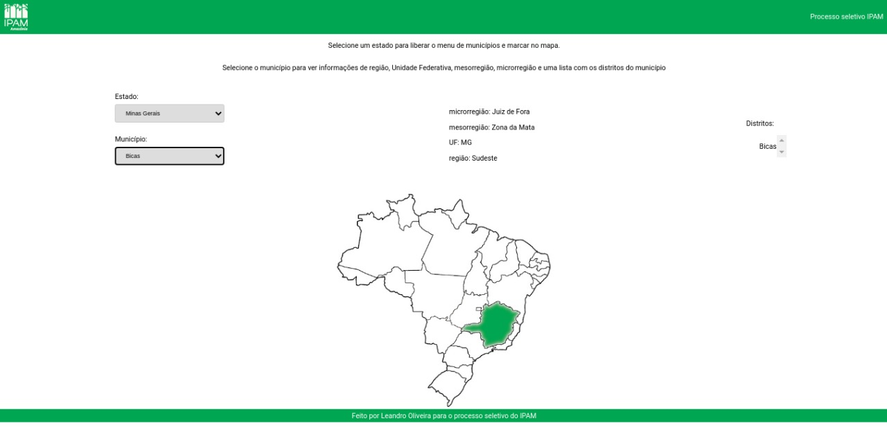

<h1>Projeto desenvolvido em React, com Redux para o processo seletivo do IPAM</h1>

Para o funcionamento do projeto, precisa do node instalado na máquina, pois é feito em React.

Tendo o node instalado, instale as dependências do projeto. 

Use o comando <strong>npm install</strong>.

após isto bastar rodar o projeto com o código
<strong>npm start</strong>.

<a href="https://ipam.vercel.app/" target="_blank" >você pode encontrar o site em funcionamento neste link</a>